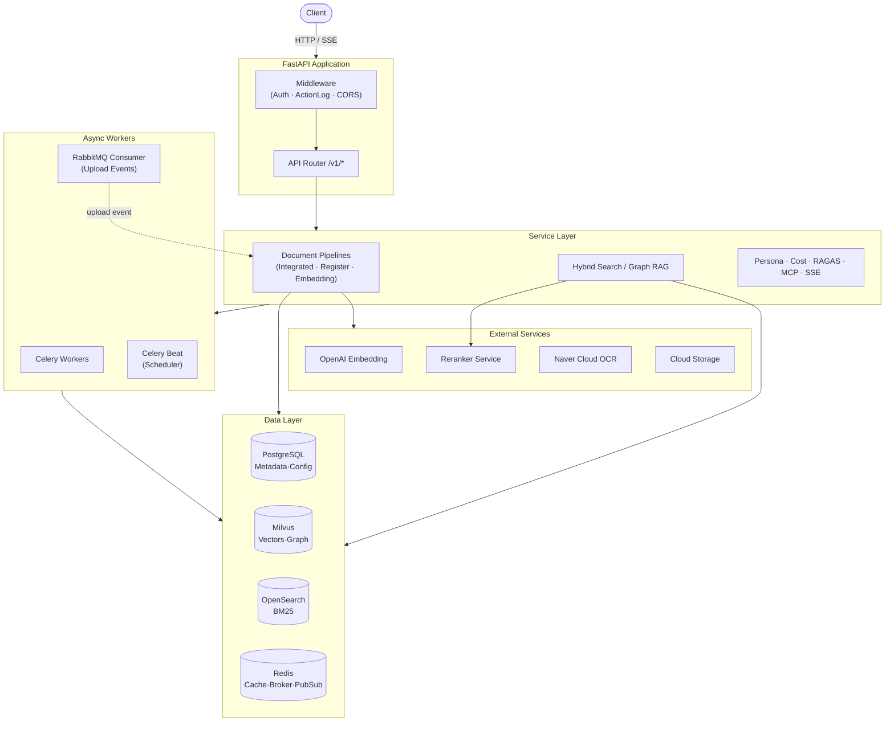
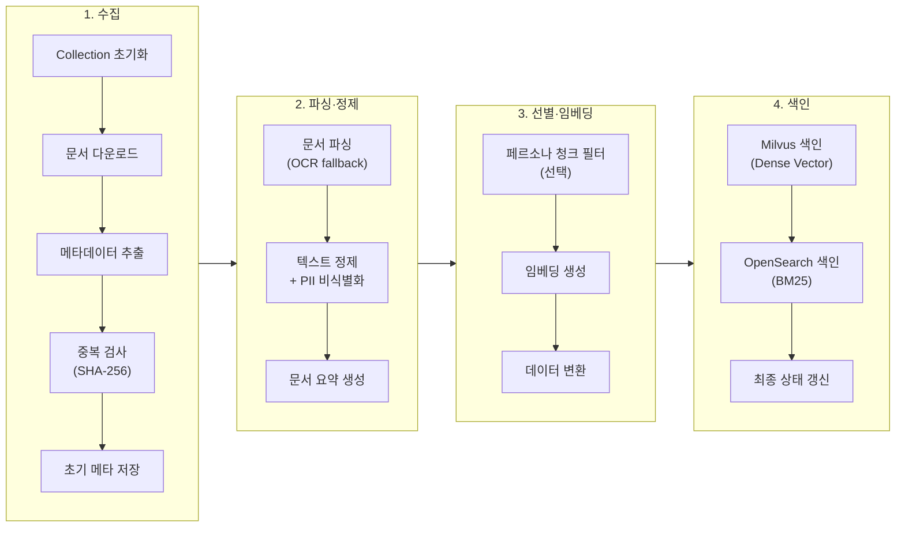
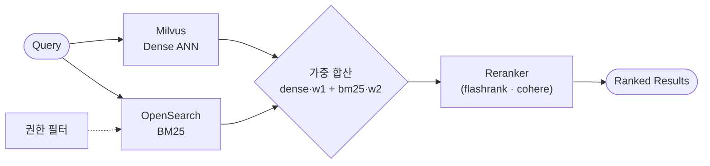

# 📚 Indexing Service


**🔍 RAG 애플리케이션을 위한 엔터프라이즈급 문서 벡터화·인덱싱·하이브리드 검색 엔진**

Indexing Service는 대규모 문서를 파싱·청킹·임베딩하여 벡터/키워드 인덱스로 만들고, 하이브리드 검색과 Graph RAG를 제공하는 고성능 비동기 백엔드 서비스입니다. 이벤트 기반 파이프라인, 페르소나 필터링, PII 비식별화, 검색 품질(RAGAS) 평가를 통해 역할별 맞춤형 지식 관리와 비용 최적화를 실현합니다.

---

## 📋 Table of Contents

- [Features](#-features)
- [Architecture](#️-architecture)
- [Document Processing Pipeline](#-document-processing-pipeline)
- [Search & Retrieval](#-search--retrieval)
- [Tech Stack](#️-tech-stack)
- [Getting Started](#-getting-started)
- [Project Structure](#-project-structure)
- [Configuration](#️-configuration)
- [API Documentation](#-api-documentation)
- [Development](#-development)
- [Docs](#-docs)

---

## ✨ Features

### 🔧 Core
- **다양한 문서 파싱** — PDF, DOCX, PPTX, Excel, 웹 페이지, 이미지(OCR) 지원
- **지능형 청킹** — Semantic / Fixed-size 전략을 설정 기반으로 선택
- **벡터 검색** — Milvus 기반 ANN(Dense) 검색
- **하이브리드 검색** — Milvus(Dense) + OpenSearch BM25(Sparse) 가중 합산 결합, 3단계 점수 정규화
- **리랭킹** — 원격 Reranker 서비스(`flashrank` / `cohere`) 및 로컬 Milvus 리랭커 지원

### 🚀 Advanced
- **Graph RAG** — 엔티티/관계 추출 및 Dual-Level(Low/High) 키워드 기반 그래프 검색
- **페르소나 필터링** — LLM이 역할·의도에 맞는 청크만 선별하여 불필요한 임베딩 비용 절감
- **PII 비식별화** — 개인정보 자동 감지 후 마스킹 / 가명화 / 일반화 처리
- **RAGAS 품질 평가** — Faithfulness·AnswerRelevancy·ContextPrecision·ContextRecall 자동 측정
- **MCP 도구 관리** — 사용자별 Retrieval MCP 인스턴스 배포·관리
- **비용 시뮬레이션** — 공급자별 토크나이저로 모델별 처리 비용 사전 예측

### ⚙️ Infrastructure
- **비동기 파이프라인** — Celery(브로커: Redis) 기반 대규모 문서 처리
- **이벤트 처리** — RabbitMQ Consumer가 클라우드 스토리지 "업로드 완료" 이벤트를 수신해 파이프라인 자동 트리거
- **실시간 알림** — SSE + Redis Pub/Sub 기반 단계별 진행 상태 스트리밍
- **스케줄링** — Celery Beat + croniter로 임베딩 자동 실행(Redis 분산 락)
- **정합성 보장** — BM25 인덱싱 실패 시 Milvus 롤백으로 스토어 간 split-brain 방지

---

## 🏗️ Architecture



---

## 🔄 Document Processing Pipeline

클라우드 스토리지의 **업로드 완료 이벤트**(RabbitMQ) 또는 API 요청으로 시작되며, Celery가 다음 단계를 순차 실행합니다. 각 단계의 진행 상태는 SSE로 실시간 스트리밍됩니다.



**파이프라인 모드**

| 모드 | 설명 | 구현 |
|------|------|------|
| **Integrated** | 등록 + 임베딩을 한 번에 수행 | `service/integrated_pipeline.py` |
| **Registration-only** | 메타데이터만 Milvus `meta` 컬렉션에 등록 | `service/document_registration_pipeline.py` |
| **Embedding-only** | 기등록 문서에 대해 임베딩만 생성 | `service/embedding_generation_pipeline.py` |

> BM25 색인 실패 시 `embedding_rollback_service.py`가 Milvus 산출물을 롤백하여 벡터/키워드 스토어 간 정합성을 유지합니다.

**지원 파서**

| 형식 | 파서 | 엔진 / 비고 |
|------|------|-------------|
| PDF | `PdfParser` | PyMuPDF · 이미지 전용 PDF는 OCR fallback |
| DOCX | `DocxParser` | python-docx |
| PPT / PPTX | `PptParser` | python-pptx |
| XLS / XLSX | `ExcelParser` | openpyxl · xlrd |
| Web | `WebParser` | BeautifulSoup · html2text |
| 이미지 / OCR | `OcrParser` | Naver Cloud OCR (General V2) |

**청킹 전략**

| 전략 | 클래스 | 설명 |
|------|--------|------|
| Fixed-size | `FixedChunker` | 고정 크기 + overlap |
| Semantic | `SemanticChunker` | 의미 기반 분할 |

---

## 🔎 Search & Retrieval

하이브리드 검색은 Dense 벡터와 BM25 점수를 **가중 합산(weighted union)** 방식으로 결합합니다 (RRF 미사용). BM25 점수는 `log1p → 분포 게이트 → Min-Max`의 3단계로 정규화됩니다.



| 검색 유형 | 설명 |
|-----------|------|
| **hybrid** | Dense(Milvus) + Sparse(BM25) 가중 결합 |
| **dense** | Milvus 벡터 단독 검색 |
| **Graph RAG** | 엔티티/관계 + Dual-Level 키워드(Low: 정확한 개체명 / High: 추상 개념) 기반 그래프 검색 |

---

## 🛠️ Tech Stack

| Category | Technology |
|----------|------------|
| **Framework** | FastAPI · Pydantic v2 · SQLAlchemy 2.0 (async) |
| **Vector DB** | Milvus 2.5 (pymilvus) — 벡터 · Graph 엔티티/관계 |
| **RDBMS** | PostgreSQL (asyncpg) — 메타/설정/스케줄/RAGAS |
| **Keyword Search** | OpenSearch (BM25) |
| **Cache / Broker / PubSub** | Redis |
| **Async / Event** | Celery · Celery Beat · RabbitMQ (aio-pika) |
| **LLM / Orchestration** | LangChain · LangGraph · LangChain-OpenAI |
| **Embedding** | OpenAI (`text-embedding-3`) |
| **Reranker** | 원격 서비스(flashrank / cohere) · 로컬 Milvus 리랭커 |
| **Document Parsing** | PyMuPDF · python-docx · python-pptx · openpyxl · Naver Cloud OCR |
| **Evaluation** | RAGAS · datasets |
| **Migration** | Alembic |

---

## 🚀 Getting Started

### Prerequisites

- Docker & Docker Compose
- Python 3.12+ (로컬 개발 시)
- [uv](https://docs.astral.sh/uv/) (로컬 개발 시)

### Quick Start

```bash
# 1. 저장소 복제
git clone https://github.com/gwanghun-choi/indexing-service.git
cd indexing-service

# 2. 환경변수 설정
cp .env.example .env
# .env 파일을 열어 필요한 값 설정

# 3. Docker Compose 실행
docker compose up -d

# 4. 서비스 상태 확인
docker compose ps
```

### 🐳 Bundled Services (docker-compose)

| Service | Container | Port | Description |
|---------|-----------|------|-------------|
| **app** | `app` | 8002 | FastAPI + Celery Worker |
| **standalone** | `milvus-standalone` | 19530 / 9091 | 벡터 데이터베이스 · 관리 API |
| **etcd** | `milvus-etcd` | 2379 | Milvus 메타데이터 저장소 |
| **minio** | `milvus-minio` | 9000 / 9001 | Milvus 오브젝트 스토리지 |
| **redis** | `redis` | 6379 | 캐시 · Celery 브로커 · Pub/Sub |

### 🔗 External Dependencies

다음 서비스는 별도 구성이 필요합니다:

- **PostgreSQL** — 메타/설정/스케줄 저장소
- **RabbitMQ** — 업로드 이벤트 소비
- **OpenSearch** — BM25 키워드 검색
- **Cloud Storage** (NCP Object Storage) — 원본 문서 저장/다운로드
- **OpenAI** — 임베딩 · LLM
- (선택) **Reranker 서비스**, **Naver Cloud OCR**

---

## 📁 Project Structure

```
app/
├── api/v1/endpoints/    # API 라우터 (documents, embeddings, graph, ragas, mcp, ...)
├── service/             # 비즈니스 로직 · 파이프라인
├── worker/              # Celery 워커 · Beat · 태스크
├── parser/              # 문서 파서 (+ adapters, utils/PII)
├── chunking/            # 청킹 전략 (fixed · semantic)
├── embedding/           # 임베딩 (OpenAI)
├── retrievers/          # 커스텀 Milvus 리트리버
├── agent/               # AI 에이전트 (persona filter)
├── crud/                # 데이터 접근 (postgres · milvus)
├── entity/              # 데이터 모델 (postgres · milvus)
├── dto/                 # 요청/응답 스키마
├── middleware/          # 인증 · 활동 로그
├── config/              # 설정 · DB · 인프라
└── utils/               # 유틸리티 (reranker, pii, notification, ...)
```

| 모듈 | 역할 | 주요 파일 |
|------|------|-----------|
| `service/` | 파이프라인·검색·평가 등 핵심 로직 | `integrated_pipeline.py`, `rabbitmq_consumer.py`, `lightrag_service.py` |
| `worker/` | 비동기 태스크·스케줄러 | `celery.py`, `document_task.py`, `schedule_tasks.py` |
| `parser/` | 형식별 파싱 + 정제/PII | `factory.py`, `pdf_parser.py`, `utils/pii_anonymizer.py` |
| `crud/milvus` | 검색·벡터·비용 CRUD | `search_crud.py`, `document_crud.py` |
| `agent/` | 페르소나 청크 필터 | `persona_filter_agent.py` |

---

## ⚙️ Configuration

환경변수는 `.env` 파일 또는 `docker-compose.yml`에서 설정합니다. 전체 항목은 `.env.example`을 참고하세요.

### 🔐 Core / Infra

| Variable | Description |
|----------|-------------|
| `POSTGRES_HOST` / `PORT` / `USER` / `PASSWORD` / `DB` | PostgreSQL 연결 |
| `MILVUS_HOST` / `MILVUS_PORT` | Milvus 연결 |
| `OPENSEARCH_HOST` / `OPENSEARCH_PORT` | OpenSearch(BM25) 연결 |
| `REDIS_URL` / `REDIS_USER` / `REDIS_PW` | Redis 연결 |
| `CELERY_BROKER_URL` | Celery 브로커 (Redis) |
| `RABBITMQ_HOST` / `PORT` / `USER` / `PASSWORD` / `VHOST` | RabbitMQ 이벤트 소비 |

### 🤖 AI / External

| Variable | Description |
|----------|-------------|
| `OPENAI_API_KEY` | OpenAI 임베딩 · LLM |
| `EMBEDDING_MODEL` | 임베딩 모델명 (예: `text-embedding-3-small`) |
| `COHERE_API_KEY` | Cohere 리랭커 |
| `RERANKER_SERVICE_URL` | 원격 Reranker 서비스 |
| `OCR_APIGW_INVOKE_URL` / `OCR_SECRET_KEY` | Naver Cloud OCR |
| `NCP_ACCESS_KEY` / `NCP_SECRET_KEY` / `NCP_BUCKET_NAME` | NCP Object Storage |
| `MCP_TOOLS_BASE_URL` | MCP 도구 배포 |
| `JWT_SECRET_KEY` / `JWT_ALGORITHM` / `CRYPT_KEY` | 인증 · 암호화 |

---

## 📖 API Documentation

서비스 실행 후 API 문서에 접근할 수 있습니다:

- **Swagger UI** — http://localhost:8002/docs
- **ReDoc** — http://localhost:8002/redoc
- **Health Check** — `GET /health`

### 🔌 Endpoints

| Endpoint | Tag | Description |
|----------|-----|-------------|
| `/v1/documents` | 문서 관리 | 문서 업로드/조회/삭제 |
| `/v1/categories` | 카테고리 관리 | 사용자 정의 카테고리 CRUD |
| `/v1/schedules` | 임베딩 스케줄 | 임베딩 자동 스케줄링 |
| `/v1/embeddings` | AI 문서 처리 | 임베딩 생성 및 하이브리드 검색 |
| `/v1/ragas` | RAGAS 평가 | 검색 파이프라인 품질 평가 |
| `/v1/mcp` | MCP 도구 관리 | 사용자별 MCP 인스턴스 배포 |
| `/v1/graph` | Graph RAG | 엔티티/관계 관리 · Dual-Level 검색 |
| `/v1/costs` | 비용 계산 | 모델별 처리 비용 계산·통계 |
| `/v1/sse` | SSE 진행 상태 | 실시간 처리 진행 스트리밍 |
| `/v1/action-logs` | 활동 로그 | 사용자 활동 기록/조회 |
| `/v1/parser-config` | 파서 설정 (관리자) | 외부 파서 설정 관리 |
| `/v1/admin` | 컬렉션 관리 (관리자) | Milvus 컬렉션 직접 관리 |

---

## 💻 Development

### Local Setup

```bash
# 의존성 설치
uv sync

# 로컬 개발 서버 실행 (Celery Beat + Worker + FastAPI)
./scripts/run_local.sh

# 테스트 실행
uv run pytest tests/ -v

# 린터 실행
uv run ruff check app/ tests/
```

### 📝 Code Style

- Python 3.12+ 타입 힌트 필수
- 비동기 함수 우선 (`async/await`) — I/O 바운드에 한정
- Pydantic v2 · SQLAlchemy 2.0 스타일
- Dict 접근은 `data["key"]` (Fail Fast), 출력은 `logger`, env는 `os.getenv`
- TDD 워크플로우: 자세한 내용은 `CLAUDE.md` 참고

---

## 📑 Docs

- 처리 흐름: [docs/WORKFLOW.md](docs/WORKFLOW.md)
- 임베딩 실패 처리: [docs/indexing/embedding_failure_minimal_fix_plan.md](docs/indexing/embedding_failure_minimal_fix_plan.md)
- BM25 실패 시 Milvus 롤백 (R-02): [docs/indexing/r02_bm25_failure_milvus_rollback.md](docs/indexing/r02_bm25_failure_milvus_rollback.md)
- 리팩토링/이슈 백로그: [docs/refactoring_and_issues_backlog.md](docs/refactoring_and_issues_backlog.md)

---

## 📄 License

MIT License
