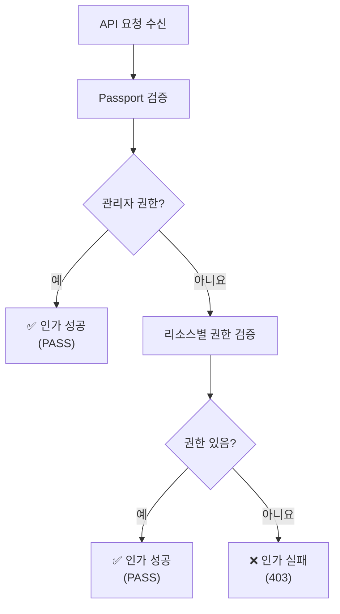

# 🔐 Passport Parser 라이브러리

JWT 기반 사용자 인증 및 권한 관리를 위한 Python 라이브러리입니다. Didim AI Studio 마이크로서비스 아키텍처에서 공통으로 사용되는 **2단계 인가(Authorization) 플로우**를 제공합니다.

---

## 📋 목차

- [개요](#-개요)
- [설치 방법](#-설치-방법)
- [2단계 인가 플로우](#-2단계-인가-플로우)
- [기본 사용법](#-기본-사용법)
- [데코레이터 사용법](#-데코레이터-사용법)
- [데이터 구조](#-데이터-구조)
- [변경 로그](#-변경-로그)

---

## 🎯 개요

**2단계 인가 플로우**를 통한 JWT 기반 권한 관리 라이브러리입니다.

### ✨ 주요 특징

- **🆕 2단계 인가**: 관리자 우선 검증 → 세부 권한 확인
- **🔐 JWT 파싱**: HTTP 헤더에서 passport 정보 자동 추출
- **🛡️ 권한 확인**: 리소스별 READ/WRITE/DELETE 권한 검증
- **🎯 데코레이터**: FastAPI 라우터에서 간편한 권한 적용

---

## 📦 설치 방법

### 1. Git Submodule 사용 (권장)

#### 📥 Submodule 추가
```bash
# 프로젝트 루트에서 submodule 추가
git submodule add https://github.com/didim365/didimAIStudio_PassportUtils.git app/utils/passport_utils

# 또는 특정 브랜치 지정
git submodule add -b main https://github.com/didim365/didimAIStudio_PassportUtils.git app/utils/passport_utils

# 초기화 및 업데이트
git submodule update --init --recursive
```

#### 🔄 Submodule 업데이트
```bash
# 최신 버전으로 업데이트
cd passport_utils
git pull origin main
cd ..
git add passport_utils
git commit -m "Update passport_utils submodule"

# 모든 submodule 한번에 업데이트
git submodule update --remote --recursive
```

#### 🗑️ Submodule 제거
```bash
# 1. .gitmodules에서 해당 항목 제거
git rm passport_utils

# 2. .git/config에서 해당 항목 제거
git config --remove-section submodule.passport_utils

# 3. 디렉토리 삭제
rm -rf .git/modules/passport_utils
```

#### 📦 프로젝트에서 사용
```python
# 사용할 때 가져오기
from passport_utils.parser import (
    authorize_request_with_exception,
    require_authorization,
    require_admin,
    parse_passport_from_headers
)
```

#### 👥 팀 협업 시 유의사항
```bash
# 다른 팀원이 submodule이 포함된 프로젝트를 클론할 때
git clone --recursive https://github.com/your-org/your-project.git

# 이미 클론된 프로젝트에서 submodule 초기화
git submodule update --init --recursive

# .gitignore에 submodule 관련 파일 추가하지 않기
# passport_utils/ 는 .gitignore에 추가하면 안됨
```

### 2. 직접 복사 방식

```bash
# 특정 서비스에 복사
cp -r didimAIStudio_PassportUtils your_service/utils/

# 가져오기
from utils.didimAIStudio_PassportUtils.parser import (
    authorize_request_with_exception,
    require_authorization
)
```

### 3. 의존성 설치

```bash
pip install fastapi>=0.68.0 pydantic>=1.8.0
```

---

## 🔄 2단계 인가 플로우



### 🎯 동작 원리

1. **1단계**: `passport.global_role >= Admin` 확인
   - 관리자면 → **즉시 통과** ✅
   - 일반 사용자면 → 2단계로 이동

2. **2단계**: `resource_type + action_type` 권한 확인
   - 권한 있으면 → **통과** ✅
   - 권한 없으면 → **거부** ❌

---

## 🚀 기본 사용법

### 1. 함수 방식 사용

```python
from fastapi import Request, HTTPException
from passport_utils.parser import (
    parse_passport_from_headers,
    authorize_request_with_exception
)

async def model_endpoint(request: Request):
    # 1. Passport 파싱
    passport = parse_passport_from_headers(request.headers)
    
    # 2. 2단계 인가 플로우 실행 (권장)
    authorize_request_with_exception(passport, "WRITE", "MODEL")
    
    # 3. 인가 성공 시 로직 실행
    return {"message": "모델 수정 성공"}
```

### 2. 반환값 확인 방식

```python
from passport_utils.parser import authorize_request

async def check_permission_endpoint(request: Request):
    passport = parse_passport_from_headers(request.headers)
    
    # True/False 반환
    if authorize_request(passport, "READ", "MODEL"):
        return {"message": "조회 권한 있음"}
    else:
        raise HTTPException(status_code=403, detail="권한 없음")
```

---

## 🎯 데코레이터 사용법 (권장)

### 1. 기본 권한 데코레이터

```python
from fastapi import APIRouter
from passport_utils.parser import require_authorization, require_admin

router = APIRouter()

# 모델 읽기 권한 필요
@router.get("/models")
@require_authorization("READ", "MODEL")
async def get_models(request: Request):
    return {"models": ["model1", "model2"]}

# 모델 생성 권한 필요
@router.post("/models")
@require_authorization("WRITE", "MODEL")
async def create_model(request: Request, model_data: dict):
    return {"message": "모델 생성 성공"}

# 모델 삭제 권한 필요
@router.delete("/models/{model_id}")
@require_authorization("DELETE", "MODEL")
async def delete_model(request: Request, model_id: str):
    return {"message": f"모델 {model_id} 삭제 성공"}
```

### 2. 관리자 전용 데코레이터

```python
# 관리자만 접근 가능
@router.get("/admin/users")
@require_admin()
async def get_all_users(request: Request):
    return {"users": ["user1", "user2"]}

# 관리자만 시스템 설정 변경 가능
@router.put("/admin/settings")
@require_admin()
async def update_settings(request: Request, settings: dict):
    return {"message": "설정 업데이트 성공"}
```

### 3. 복합 라우터 예시

```python
from fastapi import FastAPI, APIRouter
from passport_utils.parser import (
    require_authorization, 
    require_admin,
    parse_passport_from_headers
)

app = FastAPI()
router = APIRouter(prefix="/api/v1")

# 사용자 관리 라우터
@router.get("/users")
@require_authorization("READ", "USER")
async def get_users(request: Request):
    return {"users": []}

@router.post("/users")
@require_authorization("WRITE", "USER")
async def create_user(request: Request, user_data: dict):
    return {"message": "사용자 생성 성공"}

@router.delete("/users/{user_id}")
@require_admin()  # 사용자 삭제는 관리자만
async def delete_user(request: Request, user_id: str):
    return {"message": f"사용자 {user_id} 삭제 성공"}

# 그룹 관리 라우터
@router.get("/groups")
@require_authorization("READ", "GROUP")
async def get_groups(request: Request):
    return {"groups": []}

@router.post("/groups")
@require_authorization("WRITE", "GROUP")
async def create_group(request: Request, group_data: dict):
    return {"message": "그룹 생성 성공"}

app.include_router(router)
```

### 4. 미들웨어와 함께 사용

```python
from fastapi import FastAPI, Request
from fastapi.responses import JSONResponse

app = FastAPI()

@app.middleware("http")
async def passport_middleware(request: Request, call_next):
    # 공개 경로 제외
    public_paths = ["/health", "/docs", "/openapi.json"]
    if request.url.path in public_paths:
        return await call_next(request)
    
    try:
        # Passport 파싱 및 저장
        passport = parse_passport_from_headers(request.headers)
        request.state.passport = passport
    except HTTPException as e:
        return JSONResponse(
            status_code=e.status_code,
            content={"detail": e.detail}
        )
    
    return await call_next(request)
```

---

## 📊 데이터 구조

### 기본 Passport 구조

```json
{
    "user_id": "12345",
    "global_role": {"id": 1, "name": "ADMIN"},
    "group_passport": {
        "group_list": ["team_a", "team_b"],
        "group_roles": {"team_a": [100, 101]},
        "in_group_role": {"team_a": [101]}
    },
    "total_role": [1, 100, 101],
    "role_permission": {
        "1": {
            "name": "ADMIN",
            "permissions": {
                "READ": ["MODEL", "USER", "GROUP"],
                "WRITE": ["MODEL", "USER", "GROUP"],
                "DELETE": ["MODEL", "USER"]
            }
        }
    }
}
```

### 주요 필드 설명

- **`user_id`**: 사용자 고유 식별자
- **`global_role`**: 사용자의 글로벌 역할 (관리자 여부 확인)
- **`total_role`**: 사용자가 보유한 모든 역할 ID 목록
- **`role_permission`**: 각 역할별 권한 정보 (액션별 리소스 목록)

> 📝 **상세한 필드 설명**: 각 함수의 매개변수와 반환값은 `parser.py` 파일의 주석을 참조하세요.

---

## 📝 변경 로그

### v1.1.0 (2025-08-22)
- 🆕 **2단계 인가 플로우 추가**: `authorize_request()` 및 `authorize_request_with_exception()` 함수
- 🛡️ **관리자 권한 검증**: `is_admin_role()` 함수로 1단계 관리자 권한 우선 확인
- 🎯 **새로운 데코레이터**: `require_authorization()`, `require_admin()` 데코레이터 추가
- ♻️ **기존 함수 개선**: 주석 처리된 유틸리티 함수들 활성화 및 업데이트
- 📚 **문서 간소화**: 핵심 사용법과 git-submodule 방법 중심으로 재작성
- 🔄 **호환성 유지**: 기존 함수들과 완벽 호환되는 새로운 인가 시스템

### v1.0.0 (2024-07-01)
- ✨ 초기 릴리즈
- 🔐 JWT passport 파싱 기능
- 🛡️ 권한 확인 함수들
- 👥 그룹 관리 기능
- 🔧 편의 함수들

---

**© 2024 Didim AI Studio. All rights reserved.** 