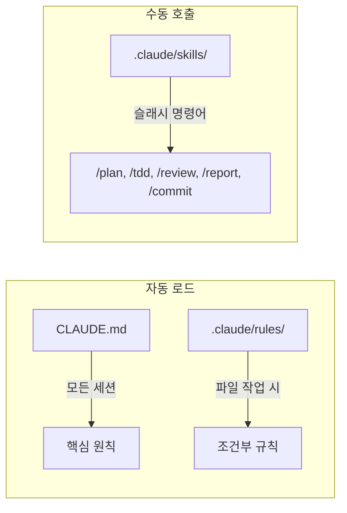
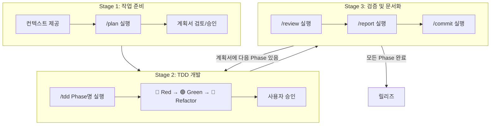

# Claude Code Skills 사용 가이드

> R2-D2 방법론 기반 Claude Code Skills 활용 가이드

---

## 1. 개요

### 1.1 Claude Code 구성 요소



### 1.2 사용 가능한 Skills

| Skill | 명령어 | 용도 |
|-------|--------|------|
| plan | `/plan <작업명>` | 작업계획서 생성 |
| tdd | `/tdd [계획서경로] <Phase명>` | TDD 사이클 실행 (계획서 자동 참조) |
| review | `/review [계획서경로] <Phase명>` | 코드 리뷰 (계획서 Phase 연계 가능) |
| report | `/report <Phase명>` | 작업결과서 생성 (리뷰 완료 후) |
| commit | `/commit [계획서경로] <Phase명> [PROJ-XXXX]` | 변경사항 커밋 (JIRA 코드 접두어 지원) |

### 1.3 사전 준비: CLAUDE.md 환경 설정

> ⚠️ **필수**: Skills 사용 전 `CLAUDE.md`의 실행환경을 본인 환경에 맞게 수정

**수정 대상 항목**:

| 항목 | 현재 값 (예시) | 수정 필요 |
|------|---------------|----------|
| 패키지 관리자 | `uv` | 본인의 패키지 관리자 (uv/poetry/pip 등) |
| 테스트 명령어 | `uv run pytest tests/ -v` | 환경에 맞게 수정 |
| 린터 명령어 | `uv run ruff check app/ tests/` | 프로젝트 구조에 맞게 수정 |
| 인프라 접속 정보 | `.env` (`.env.example` 참고) | 본인의 DB/서버 주소 |

**CLAUDE.md 위치**: 프로젝트 루트의 `CLAUDE.md` 파일

> 💡 Skills가 테스트/린터 실행 시 `@CLAUDE.md`에 명시된 명령어를 참조합니다.

### 1.4 사전 준비: 첨부파일 설치

> ⚠️ **필수**: 이 가이드와 함께 제공된 첨부파일을 **본인의 프로젝트 루트 디렉토리**에 저장

**첨부파일 목록**:

| 파일/폴더 | 저장 위치 | 설명 |
|-----------|----------|------|
| `CLAUDE.md` | `<프로젝트 루트>/CLAUDE.md` | 프로젝트 핵심 설정 (환경 수정 필수) |
| `docs/working_template/` | `<프로젝트 루트>/docs/working_template/` | 템플릿 및 방법론 문서 |
| `.claude/` | `<프로젝트 루트>/.claude/` | Skills 및 Rules 정의 |

**설치 후 디렉토리 구조**:

```
your-project/
├── .claude/
│   ├── skills/          # /plan, /tdd, /review, /report, /commit
│   └── rules/           # 자동 적용 규칙
├── docs/
│   └── working_template/
│       ├── 00_vibecoding_workflow.md
│       ├── 00_claude_skills_guide.md   # 본 문서
│       ├── 01_todolist_performance_template.md
│       ├── 02_code_review_template.md
│       ├── 03_work_result_report_template.md
│       ├── 99_TDD_plan.md
│       └── 100_Python_Performance_Guide.md
├── CLAUDE.md
└── ... (기존 프로젝트 파일)
```

> 💡 기존에 동일한 파일/폴더가 있는 경우, 내용을 병합하거나 백업 후 덮어쓰세요.

---

## 2. 전체 워크플로우

### 2.1 용어 정의

| 용어 | 의미 | 예시 |
|------|------|------|
| **Stage** | 워크플로우 단계 | Stage 1 (준비), Stage 2 (개발), Stage 3 (검증) |
| **Phase** | 작업계획서의 작업 단위 | Phase1 (싱글톤), Phase2 (비동기 래퍼) |
| **Step** | TDD 사이클 단계 | Step 1 (Red), Step 2 (Green), Step 3 (Refactor) |

### 2.2 워크플로우 다이어그램



---

## 3. Skill 상세

> 아래 예시는 "Milvus 비동기 클라이언트 구현" 작업을 기준으로 작성

### 3.1 `/plan` - 작업계획서 생성

**목적**: TDD 기반 작업계획서 생성

**사용법**:
```
/plan <작업명>
```

**주의**: 명령어 실행 전 컨텍스트(현재 상황, 요구사항)를 먼저 제공해야 정확한 계획서 생성

**출력물**: `docs/working_history/YYMMDD/<작업명>_todolist.md`

**예시**:
```
Milvus 클라이언트에 비동기 기능을 추가해야 해.

현재 상황:
- app/config/database/milvus.py에 동기 MilvusClient가 있음
- FastAPI 엔드포인트에서 호출 시 블로킹 발생

요구사항:
1. 기존 동기 클라이언트 유지 (Celery Worker용)
2. 비동기 래퍼 함수 추가 (FastAPI용)
3. 싱글톤 패턴 적용

/plan async-milvus-client
```

---

### 3.2 `/tdd` - TDD 사이클 실행

**목적**: 작업계획서의 Phase를 Red → Green → Refactor 사이클로 구현

**사용법**:
```
/tdd <Phase명>                    # 최근 계획서에서 Phase 탐색
/tdd <계획서명> <Phase명>          # 특정 계획서 지정
/tdd <전체경로> <Phase명>          # 전체 경로로 지정
```

**TDD 사이클 (Step 1 → 2 → 3)**:


**예시**:
```
# 계획서의 Phase1 실행
/tdd Phase1

# 특정 계획서 지정
/tdd async-milvus-client Phase1

# 전체 경로로 지정
/tdd docs/working_history/2026/260129/async-milvus_todolist.md Phase1
```

---

### 3.3 `/review` - 코드 리뷰

**목적**: 변경 코드의 품질, 보안, 성능 검증 (계획서 Phase 연계 가능)

**사용법**:
```
/review <Phase명>                  # 최근 계획서의 Phase 관련 파일 리뷰
/review <계획서명> <Phase명>        # 특정 계획서의 Phase 관련 파일 리뷰
/review <전체경로> <Phase명>        # 전체 경로로 계획서 지정
/review <경로>                     # 특정 경로 직접 리뷰
/review                            # 최근 변경 파일 전체
```

**예시**:
```
# 계획서의 Phase1 실행
/review Phase1

# 특정 계획서 지정
/review async-milvus-client Phase1

# 전체 경로로 지정
/review docs/working_history/2026/260129/async-milvus_todolist.md Phase1
```

---

### 3.4 `/report` - 작업결과서 생성

**목적**: 리뷰 완료 후 Phase 최종 결과 기록, 다음 작업의 RAG 컨텍스트 제공

**사용법**:
```
/report <Phase명>                  # 최근 계획서의 Phase 결과서 생성
/report <계획서명> <Phase명>        # 특정 계획서의 Phase 결과서 생성
/report <전체경로> <Phase명>        # 전체 경로로 계획서 지정
```

**출력물**: `docs/working_history/YYMMDD/<Phase명>_<날짜>.md`

**예시**:
```
# 계획서의 Phase1 실행
/report Phase1

# 특정 계획서 지정
/report async-milvus-client Phase1

# 전체 경로로 지정
/report docs/working_history/2026/260129/async-milvus_todolist.md Phase1
```

---

### 3.5 `/commit` - 변경사항 커밋

**목적**: Phase 완료 후 변경사항 커밋 (JIRA 코드 접두어 지원)

**사용법**:
```
/commit <Phase명>                  # 최근 계획서의 Phase 관련 변경 커밋
/commit <계획서명> <Phase명>        # 특정 계획서의 Phase 관련 변경 커밋
/commit <전체경로> <Phase명>        # 전체 경로로 계획서 지정
/commit <Phase명> <PROJ-XXXX>       # JIRA 코드 포함 커밋
```

**예시**:
```
# 계획서의 Phase1 실행
/commit Phase1

# 특정 계획서 지정
/commit async-milvus-client Phase1

# 전체 경로로 지정
/commit docs/working_history/2026/260129/async-milvus_todolist.md Phase1

# JIRA 코드 포함 커밋
/commit Phase1 PROJ-1234
```

---

### 3.6 진행 상태 추적

**계획서 체크박스 자동 업데이트**:

각 스킬 완료 시 작업계획서의 해당 Phase 진행 상태가 자동 업데이트됩니다.

```markdown
## Phase1: 싱글톤 구현

**진행 상태**:
- [x] TDD 완료 (/tdd)       ← /tdd Phase1 완료 시 체크
- [x] 코드 리뷰 완료 (/review) ← /review Phase1 완료 시 체크
- [x] 결과서 작성 (/report)   ← /report Phase1 완료 시 체크
- [x] 커밋 완료 (/commit)    ← /commit Phase1 완료 시 체크
```

**진행 흐름**:


---

## 4. 규칙

### 4.1 커밋 규율

| 조건 | 필수 |
|------|------|
| 모든 테스트 PASSED | ✅ |
| ruff check 경고 0개 | ✅ |
| 사용자 명시적 승인 | ✅ |

### 4.2 롤백 규율

| 상황 | 조치 |
|------|------|
| AI가 잘못된 방향으로 진행 | `git reset --hard HEAD` |
| 설계 방향 자체가 잘못됨 | 작업계획서 재검토 후 롤백 |

### 4.3 자동 적용 Rules

| Rule | 적용 경로 | 내용 |
|------|----------|------|
| TDD 원칙 | `src/**/*.py`, `app/**/*.py`, `tests/**/*.py` | Red→Green→Refactor, Tidy First |
| 성능 가이드 | `src/**/*.py`, `app/**/*.py` | 데이터 구조, 비동기, 보안 |

---

## 5. 문서 참조 관계

```
CLAUDE.md (항상 로드)
└── docs/working_template/
    ├── 00_vibecoding_workflow.md      # R2-D2 전체 워크플로우
    ├── 00_claude_skills_guide.md      # Skills 사용 가이드 (본 문서)
    ├── 01_todolist_performance_template.md   # /plan 템플릿
    ├── 02_code_review_template.md     # /review 템플릿
    ├── 03_work_result_report_template.md     # /report 템플릿
    ├── 99_TDD_plan.md                 # TDD 방법론 (rules 참조)
    └── 100_Python_Performance_Guide.md       # 성능 가이드 (rules 참조)
```

---

**작성일**: 2026-01-29
**버전**: 1.2
